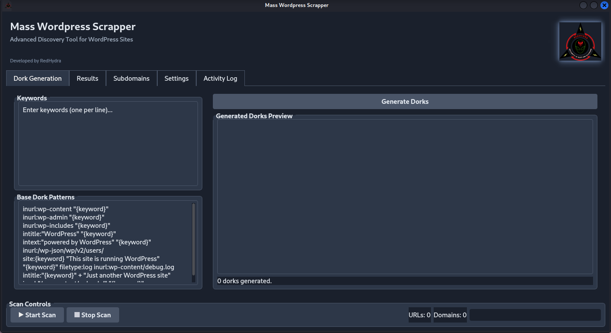

<!-- Banner -->
<p align="center">
  
</p>

<h1 align="center" style="color:#38A169;">Mass WordPress Scrapper v2</h1>
<p align="center">
  <b>A deeply enhanced discovery and reconnaissance tool with concurrent dork & subdomain scanning for WordPress sites.</b><br>
  <i>Developed by RedHydra</i>
</p>

---

## 📜 Overview

**Mass WordPress Scrapper v2** is a powerful, cross-platform tool designed for penetration testers and security researchers to discover and analyze WordPress websites on a massive scale. Version 2 moves beyond simple discovery, incorporating a deep analysis engine to scrape valuable intelligence from target sites.

It automates reconnaissance by combining high-speed dorking, AI-powered query generation, and extensive subdomain enumeration with detailed site analysis to uncover versions, plugins, themes, exposed files, and potential misconfigurations.

---

## ✨ v2 Key Enhancements

- **Deep Site Analysis**: Now scrapes for WP Version, REST API endpoints, user info via author enumeration, exposed backup files, and common plugins/themes.
- **Vastly Expanded Discovery**: Fetches 4x more results per dork and scans over 100 common subdomains per domain (up from 10).
- **Functional AI Dorking**: The previously non-functional Gemini AI feature is now fully implemented and fixed, allowing you to generate hundreds of creative dorks.
- **Performance Tuning**: Default settings have been optimized for faster, more aggressive scanning.

---

## 🎯 Core Features

- 🔍 **Concurrent Dork Scanning**: Uses `asyncio` and DuckDuckGo to process a huge number of dorks with incredible speed.
- 🤖 **Gemini AI Integration**: Provide an API key to automatically generate hundreds of unique, high-quality dorks based on your keywords.
- 🌐 **Advanced Subdomain Discovery**: Finds potential targets through `crt.sh` certificate logs and an expanded built-in seed list.
- 🕵️ **Detailed Reconnaissance**: Probes each discovered site to identify:
    - WordPress Version
    - Exposed Endpoints (`wp-json`, `xmlrpc`, etc.)
    - Publicly accessible files (`readme.html`, `license.txt`, backups)
    - Usernames (via author enumeration)
    - Hints of installed Plugins & Themes
- 🖥️ **Modern PyQt5 GUI**: A sleek, user-friendly interface with a dark theme, real-time logging, and organized results.
- 💾 **Exportable Results**: Save all found URLs, domains, and detailed subdomain analysis to `.txt` and `.json` files.

---

## ⚠️ Black Hat Motivations & Benefits (For Educational Purposes)

**DISCLAIMER**: The following information describes how malicious actors (black hat hackers) could misuse the data gathered by this tool. These activities are illegal, unethical, and can lead to severe legal consequences. This section is included strictly for educational purposes to help defenders and security professionals understand the threat landscape.

A black hat hacker's primary goal is financial gain. The data from WPScrapper is not just a list of sites; it's a curated map of potential victims and attack vectors. Here's how it can be monetized:

1.  **Exploiting Outdated Software (N-Day Vulnerabilities)**
    - **Method**: The tool identifies the exact WordPress version and often the versions of plugins/themes. An attacker can cross-reference this list with public vulnerability databases (like CVEs) to find known, unpatched exploits.
    - **Benefit**: Gaining initial access to a server is the first step. From there, an attacker can deploy **ransomware**, install **cryptocurrency miners** that use the victim's server resources, or steal sensitive data. A single successful ransomware attack can net thousands of dollars.

2.  **Credential and Data Harvesting**
    - **Method**: The tool specifically looks for exposed backup files like `wp-config.php.bak` or `db.sql`. These files are treasure troves containing database credentials (usernames, passwords), which can be used to access the database directly.
    - **Benefit**: Stolen customer data (emails, passwords, personal information) is a highly valuable commodity sold on darknet markets. A fresh database from an e-commerce site can be sold for hundreds or thousands of dollars.

3.  **Building Botnets for Phishing or DDoS Attacks**
    - **Method**: By exploiting vulnerabilities at scale, an attacker can compromise hundreds of WordPress sites and silently install malicious code. These compromised sites become part of a "botnet."
    - **Benefit**: The botnet can be rented out to other criminals to launch **DDoS (Distributed Denial-of-Service) attacks**, which take other websites offline for a fee. Alternatively, the sites can be used to host convincing **phishing pages** (e.g., fake bank logins) to steal credentials from a wider audience.

4.  **Spear Phishing and Targeted Scams**
    - **Method**: The tool can generate lists of sites belonging to a specific niche (e.g., "real estate agents in New York," "online jewelry stores").
    - **Benefit**: This allows for highly targeted **spear-phishing** campaigns. The attacker can craft convincing emails pretending to be a service provider or customer to trick website owners into revealing passwords or making fraudulent payments. This targeted approach has a much higher success rate than generic spam.

5.  **Account Takeover via Brute-Forcing**
    - **Method**: The "author enumeration" feature reveals valid usernames. This eliminates half the work of a brute-force attack. The attacker knows a real user exists and can focus their efforts on guessing just the password.
    - **Benefit**: Gaining access to an admin account means full control of the website. They can deface it, redirect traffic to malicious sites, or steal its content. Taking over user accounts on e-commerce sites can lead to credit card fraud.

Understanding these attack vectors is the first step to building a strong defense. Always keep WordPress core, plugins, and themes updated, and never leave sensitive backup files on a public server.

---

## 🚀 Installation

The tool is cross-platform. Follow the instructions for your operating system.

**Prerequisites:**
- Python 3.8+
- Git

### 🐧 Linux (Debian/Ubuntu, Kali Linux)
```bash
# Update package list and install dependencies
sudo apt update && sudo apt install git python3-pip python3-venv -y

# Clone the repository
git clone https://github.com/root60/WPScrapper.git
cd WPScrapper

# Create and activate a virtual environment
python3 -m venv venv
source venv/bin/activate

# Install required Python packages
pip install ddgs aiodns aiohttp PyQt5 colorama google-generativeai
```

### 🪟 Windows
```powershell
# Clone the repository using Git Bash or another git client
git clone https://github.com/root60/WPScrapper.git
cd WPScrapper

# Create and activate a virtual environment
python -m venv venv
.\venv\Scripts\activate

# Install required Python packages
pip install ddgs aiodns aiohttp PyQt5 colorama google-generativeai
```

---

## 🛠 Usage

### 🖥️ GUI Mode (Recommended)
This is the primary way to use the tool, giving you access to all features.

1.  **Run the application:**
    ```bash
    # On Linux
    python3 WPScrapper.py
    
    # On Windows
    py -3 WPScrapper.py
    ```
2.  **Generate Dorks:**
    - Navigate to the **"Dork Generation"** tab.
    - Enter keywords into the "Keywords" box (e.g., `real estate`, `local business`, `online store`).
    - **(Optional for AI)** Go to the **Settings** tab, add your Google Gemini API key, and check "Use Gemini..."
    - Click **"Generate Dorks"**. The preview box will fill with standard and (if enabled) AI-generated dorks.
3.  **Start the Scan:**
    - Click the **"Start Scan"** button.
    - Monitor progress in the **Activity Log** tab and see live results populate in the **Results** and **Subdomains** tabs.

### ⌨️ CLI Mode
The script automatically falls back to a command-line interface if `PyQt5` is not installed, making it ideal for servers or headless systems.
- Run the script as above.
- It will prompt you to enter keywords one by one. Press Enter on an empty line to start the scan.

---

## ⚙ Configuration
- On first run, a `config.json` file is generated.
- Scan settings, concurrency, and API keys can be modified from the **Settings** tab in the GUI or by editing the file directly.
- All results are saved in the `results/` directory for persistence and analysis.

---

## 📄 License
This project is released under the **MIT License**.  
It is intended for educational and ethical security research purposes only. The developer is not responsible for any misuse of this tool.
