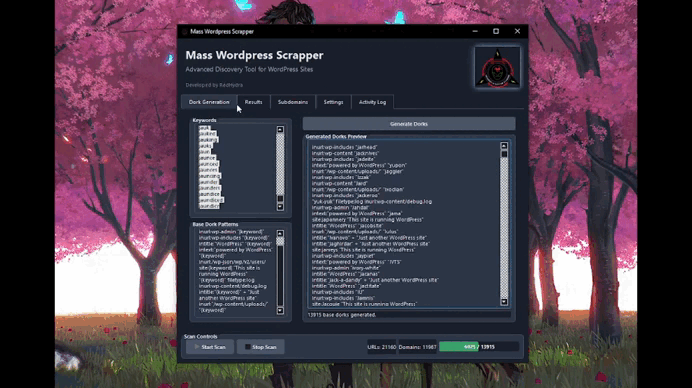

<!-- Banner -->
<p align="center">
  
</p>

<h1 align="center" style="color:#38A169;">Mass WordPress Scrapper v2</h1>
<p align="center">
  <b>A deeply enhanced discovery and reconnaissance tool with concurrent dork & subdomain scanning for WordPress sites.</b><br>
  <i>Developed by RedHydra</i>
</p>

---

## 📜 Overview

**Mass WordPress Scrapper v2** is a powerful, cross-platform tool designed for penetration testers and security researchers to discover and analyze WordPress websites on a massive scale. Version 2 moves beyond simple discovery, incorporating a deep analysis engine to scrape valuable intelligence from target sites.

It automates reconnaissance by combining high-speed dorking, AI-powered query generation, and extensive subdomain enumeration with detailed site analysis to uncover versions, plugins, themes, exposed files, and potential misconfigurations.

---

## ✨ v2 Key Enhancements

- **Deep Site Analysis**: Now scrapes for WP Version, REST API endpoints, user info via author enumeration, exposed backup files, and common plugins/themes.
- **Vastly Expanded Discovery**: Fetches 4x more results per dork and scans over 100 common subdomains per domain (up from 10).
- **Functional AI Dorking**: The previously non-functional Gemini AI feature is now fully implemented and fixed, allowing you to generate hundreds of creative dorks.
- **Performance Tuning**: Default settings have been optimized for faster, more aggressive scanning.

---

## 🎯 Core Features

- 🔍 **Concurrent Dork Scanning**: Uses `asyncio` and DuckDuckGo to process a huge number of dorks with incredible speed.
- 🤖 **Gemini AI Integration**: Provide an API key to automatically generate hundreds of unique, high-quality dorks based on your keywords.
- 🌐 **Advanced Subdomain Discovery**: Finds potential targets through `crt.sh` certificate logs and an expanded built-in seed list.
- 🕵️ **Detailed Reconnaissance**: Probes each discovered site to identify:
    - WordPress Version
    - Exposed Endpoints (`wp-json`, `xmlrpc`, etc.)
    - Publicly accessible files (`readme.html`, `license.txt`, backups)
    - Usernames (via author enumeration)
    - Hints of installed Plugins & Themes
- 🖥️ **Modern PyQt5 GUI**: A sleek, user-friendly interface with a dark theme, real-time logging, and organized results.
- 💾 **Exportable Results**: Save all found URLs, domains, and detailed subdomain analysis to `.txt` and `.json` files.

---

## 📷 Screenshot

<p align="center">
  
</p>

---

## 🚀 Installation

The tool is cross-platform. Follow the instructions for your operating system.

**Prerequisites:**
- Python 3.8+
- Git

### 🐧 Linux (Debian/Ubuntu, Kali Linux)
```bash
# Update package list and install dependencies
sudo apt update && sudo apt install git python3-pip python3-venv -y

# Clone the repository
git clone https://github.com/root60/WPScrapper.git
cd WPScrapper

# Create and activate a virtual environment
python3 -m venv venv
source venv/bin/activate

# Install required Python packages
pip install ddgs aiodns aiohttp PyQt5 colorama google-generativeai
```

### 🪟 Windows
```powershell
# Clone the repository using Git Bash or another git client
git clone https://github.com/root60/WPScrapper.git
cd WPScrapper

# Create and activate a virtual environment
python -m venv venv
.\venv\Scripts\activate

# Install required Python packages
pip install ddgs aiodns aiohttp PyQt5 colorama google-generativeai
```

---

## 🛠 Usage

### 🖥️ GUI Mode (Recommended)
This is the primary way to use the tool, giving you access to all features.

1.  **Run the application:**
    ```bash
    # On Linux
    python3 WPScrapper.py
    
    # On Windows
    py -3 WPScrapper.py
    ```
2.  **Generate Dorks:**
    - Navigate to the **"Dork Generation"** tab.
    - Enter keywords into the "Keywords" box (e.g., `real estate`, `local business`, `online store`).
    - **(Optional for AI)** Go to the **Settings** tab, add your Google Gemini API key, and check "Use Gemini..."
    - Click **"Generate Dorks"**. The preview box will fill with standard and (if enabled) AI-generated dorks.
3.  **Start the Scan:**
    - Click the **"Start Scan"** button.
    - Monitor progress in the **Activity Log** tab and see live results populate in the **Results** and **Subdomains** tabs.

### ⌨️ CLI Mode
The script automatically falls back to a command-line interface if `PyQt5` is not installed, making it ideal for servers or headless systems.
- Run the script as above.
- It will prompt you to enter keywords one by one. Press Enter on an empty line to start the scan.

---

## ✅ Benefits

#### For All Users
- **Automation**: Automates hours of manual reconnaissance work into a single click.
- **Efficiency**: The asynchronous engine can perform hundreds of network operations concurrently, delivering results fast.
- **Deep Intelligence**: Goes beyond just finding sites to providing actionable intelligence about their configuration.

#### Benefits for Windows Users
- **User-Friendly**: Provides a simple and intuitive graphical interface, eliminating the need for complex command-line arguments.
- **All-in-One**: Manage keywords, dorks, settings, and results from a single window.
- **Easy Access**: Perfect for researchers who prefer a straightforward, visual workflow.

#### Benefits for Linux Users
- **Server & SSH Ready**: The CLI fallback allows the tool to run on headless servers or over SSH connections.
- **Scripting & Integration**: Can be integrated into larger security testing pipelines and automation scripts.
- **Pentesting Power**: A perfect addition to pentesting distributions like Kali Linux, complementing other reconnaissance tools.

---

## ⚙ Configuration
- On first run, a `config.json` file is generated.
- Scan settings, concurrency, and API keys can be modified from the **Settings** tab in the GUI or by editing the file directly.
- All results are saved in the `results/` directory for persistence and analysis.

---

## 📌 Notes
- The scanner primarily uses **DuckDuckGo** to avoid the strict rate-limiting and CAPTCHAs imposed by Google.
- Subdomain enumeration is **passive** and relies on public data to remain stealthy and responsible.
- This tool is designed for **Windows** and **Linux**. For GUI use on Linux, an X11 server is required (standard on most desktop environments).

---

## 📄 License
This project is released under the **MIT License**.  
It is intended for educational and ethical security research purposes only. The developer is not responsible for any misuse of this tool.
